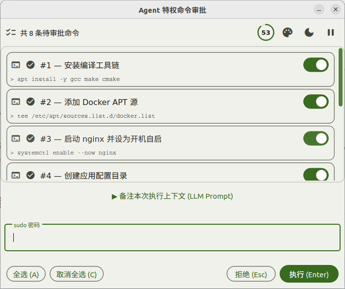

<h1 align="center">agent-sudo</h1>

<p align="center">
  AI Agent 特权命令审批网关 — 队列化 sudo 请求，通过 GUI 窗口让人类一键审批。
  <br />
  <a href="#快速开始"><strong>快速开始 &raquo;</strong></a>
  ·
  <a href="#安装"><strong>安装 &raquo;</strong></a>
  ·
  <a href="#工作原理"><strong>工作原理 &raquo;</strong></a>
</p>

<p align="center">
  
  
  
</p>

---

## 这是什么

AI Agent 在执行任务时经常需要 root 权限 — 装软件包、管理系统服务、写 `/etc` 配置。但直接给 Agent 免密 sudo 太危险。

**agent-sudo** 解决了这个问题：Agent 把需要特权的命令排进队列，然后弹出一个 GUI 窗口供人类查看、勾选、审批。一条命令都不漏，一条命令都不多。



## 快速开始

Agent 按以下模式工作：

```bash
# 1. 逐条队列特权命令，每条附带理由
agent-sudo --reason "安装编译工具链" -- apt install -y gcc make cmake
agent-sudo --reason "启动 nginx 服务" -- systemctl enable --now nginx

# 2. 一次性提交审批（弹出 GUI 窗口，阻塞等待人类操作）
agent-sudo-flush
```

人类在 GUI 窗口中：
- 看到每条命令的**理由**和**完整命令**
- 勾选/取消不需要的命令
- 输入 sudo 密码
- 点击执行或拒绝

## 功能

| 功能 | 说明 |
|---|---|
| 命令队列 | 支持逐条添加，批量审批 |
| 审批 GUI | PySide2 原生 Qt5 窗口，macOS Soft 设计风格 |
| 理由标注 | 每条命令附带人类可读的理由 |
| 倒计时自动拒绝 | 60 秒无操作自动拒绝，避免 Agent 永久阻塞 |
| 勾选控制 | 可以取消不需要的命令，只执行选中的 |
| LLM 备注 | 可选的文本输入区，人类可以给 Agent 留言 |
| 执行历史 | 所有审批记录保存在 `~/.cache/agent-sudo/history.json` |
| 密码安全 | 密码仅通过内存传递，用完立即清零 |

## 安装

### 面向人类

将下面这段话复制给你的 LLM Agent：

```markdown
参考 [INSTALL.md](https://raw.githubusercontent.com/7emotions/agent-sudo/main/INSTALL.md) 安装 agent-sudo。
```

### 面向 LLM Agent

参考 [`INSTALL.md`](INSTALL.md) 了解完整安装步骤。核心依赖：

- Python 3.8+
- PySide2 (`pip install PySide2`)
- 有图形会话 (`$DISPLAY` 非空)
- `/usr/bin/sudo`

安装后创建符号链接：

```bash
ln -s $(pwd)/src/main.py /usr/local/bin/agent-sudo
ln -s $(pwd)/src/main.py /usr/local/bin/agent-sudo-flush
```

## 使用示例

### 基础用法

```bash
agent-sudo --reason "安装 curl" -- apt install -y curl
agent-sudo-flush
```

### 多条命令批量审批

```bash
agent-sudo --reason "安装 Docker 依赖" -- apt install -y ca-certificates curl gnupg
agent-sudo --reason "添加 Docker GPG key" -- install -m 0755 -d /etc/apt/keyrings
agent-sudo --reason "添加 Docker 源" -- tee /etc/apt/sources.list.d/docker.list
agent-sudo-flush
```

### 工作流集成

在自动化脚本或 Agent 编排中：

```bash
# 队列所有特权操作
agent-sudo --reason "安装系统依赖" -- apt install -y build-essential git
agent-sudo --reason "安装 H.264 解码器" -- apt install -y gstreamer1.0-plugins-ugly

# 提交审批
agent-sudo-flush

# 根据退出码决定后续行为
case $? in
  0)   echo "审批通过，命令已执行" ;;
  126) echo "用户拒绝或窗口关闭" ;;
  124) echo "执行超时" ;;
  127) echo "错误（队列为空、无 DISPLAY 等）" ;;
esac
```

## 工作原理

```
Agent                       agent-sudo                       Human
  │                              │                              │
  ├─ agent-sudo --reason "..." ─►│  写入 queue.json             │
  ├─ agent-sudo --reason "..." ─►│  追加 queue.json             │
  │                              │                              │
  ├─ agent-sudo-flush ──────────►│  读取 queue.json             │
  │                              ├─ 弹出 PySide2 GUI ──────────►│  查看命令
  │  [阻塞等待]                   │                              │  勾选/取消
  │                              │                              │  输入密码
  │                              │◄────────── 点击执行 ─────────┤
  │                              ├─ 执行 sudo 命令               │
  │                              ├─ 写入 history.json           │
  │◄─────── 退出码 ──────────────┤                              │
  │  继续工作                     │                              │
```

## 退出码

| 码 | 含义 |
|---|---|
| 0 | 所有勾选的命令执行成功 |
| 124 | 执行超时（300 秒） |
| 126 | 用户拒绝、窗口关闭、或 60 秒倒计时自动拒绝 |
| 127 | 错误：队列为空、`$DISPLAY` 未设置、或启动失败 |

## 文件结构

```
agent-sudo/
├── src/
│   ├── main.py              # CLI + GUI 主程序（agent-sudo / agent-sudo-flush）
│   ├── e2e_test.py          # 端到端测试
│   ├── functional_gui_test.py
│   └── test.sh              # 集成测试脚本
├── imgs/
│   └── agent-sudo-gui.png   # GUI 截图
├── SKILL.md                 # OpenCode Skill 定义
├── INSTALL.md
├── LICENSE
└── README.md
```

## 贡献

欢迎提交 Issue 和 Pull Request。

## 许可

MIT License © 2026 Lorenzo Feng — 详见 [LICENSE](LICENSE)。
