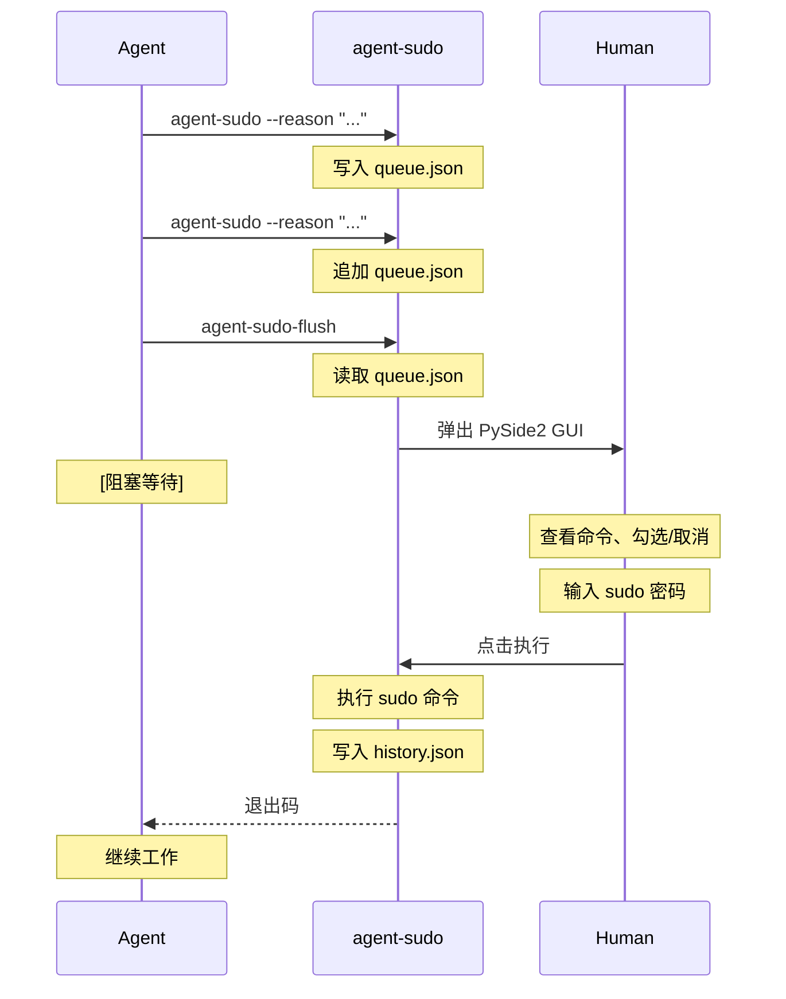

<h1 align="center">agent-sudo</h1>

<p align="center">
  AI Agent 特权命令审批网关 — 队列化 sudo 请求，通过 GUI 窗口让人类一键审批。
  <br />
  <a href="#为什么不用-pkexec--sudo"><strong>为什么不用 pkexec？ &raquo;</strong></a>
  ·
  <a href="#快速开始"><strong>快速开始 &raquo;</strong></a>
  ·
  <a href="#安装"><strong>安装 &raquo;</strong></a>
  ·
  <a href="#工作原理"><strong>工作原理 &raquo;</strong></a>
</p>

<p align="center">
  
  
  
  
</p>

---

## 这是什么

AI Agent 在执行任务时经常需要 root 权限 — 装软件包、管理系统服务、写 `/etc` 配置。但直接给 Agent 免密 sudo 太危险。

**agent-sudo** 解决了这个问题：Agent 把需要特权的命令排进队列，然后弹出一个 GUI 窗口供人类查看、勾选、审批。一条命令都不漏，一条命令都不多。

<p align="center">
  
</p>

## 为什么不用 pkexec / sudo？

| 方案 | 问题 |
|---|---|
| `sudo` 免密 | Agent 拥有不受限的 root 权限，一条 `rm -rf /` 就能毁灭系统 |
| `pkexec` | 每条命令弹一次 PolicyKit 对话框，Agent 执行 10 条命令你就要点 10 次确认，且看不到全局上下文 |
| `sudoers` 白名单 | 需要 root 编辑 `/etc/sudoers`，命令必须预先写死，Agent 需要的新命令不在白名单里就卡住 |
| PolKit 规则 | 配置复杂（XML/JS），调试困难，不适合动态的 Agent 工作流 |

**agent-sudo** 的区别：

| 特性 | agent-sudo | pkexec | sudo NOPASSWD |
|---|---|---|---|
| 批量审批 | 所有命令在一个窗口 | 逐条弹窗 | — |
| 命令理由 | 每条附带 `--reason` | 无 | 无 |
| 选择性执行 | 可取消不需要的命令 | 只能全接受或全拒绝 |
| 审计记录 | `history.json` 记录每次审批 | 仅 syslog | 仅 syslog |
| 倒计时保护 | 60 秒无人操作自动拒绝 | PolicyKit 默认超时 | 无 |
| 人类反馈 | 可留言给 Agent | 无 | 无 |
| 配置复杂度 | 零配置，开箱即用 | 需要 DBus + PolicyKit | 需要编辑 sudoers |
| 密码安全 | 内存中使用后立即清零 | PolicyKit agent 管理 | 缓存 5 分钟 |

## 快速开始

Agent 按以下模式工作：

```bash
# 1. 逐条队列特权命令，每条附带理由
agent-sudo --reason "安装编译工具链" -- apt install -y gcc make cmake
agent-sudo --reason "启动 nginx 服务" -- systemctl enable --now nginx

# 2. 一次性提交审批（弹出 GUI 窗口，阻塞等待人类操作）
agent-sudo-flush
```

人类在 GUI 窗口中：
- 看到每条命令的**理由**和**完整命令**
- 勾选/取消不需要的命令
- 输入 sudo 密码
- 点击执行或拒绝

## 功能

| 功能 | 说明 |
|---|---|---|
| 命令队列 | 支持逐条添加，批量审批 |
| 审批 GUI | Qt6 C++ 原生窗口，creeper-qt 声明式组件 |
| 主题管理 | 3 套预设 + 亮/暗模式，MixerMask 展开动画 |
| 危险检测 | 自动识别安全/警告/危险命令，卡片颜色区分 |
| 图标系统 | Material Icons Round 图标，悬浮高亮边框 |
| 键盘快捷键 | Esc 拒绝 / A 全选 / C 取消全选 / Enter 执行 |
| 多语言 | 8 种语言（zh/en/ja/ko/fr/de/es/pt），JSON 驱动 |
| 声音反馈 | 4 事件触发，QSettings 自定义音效路径 |
| 倒计时保护 | 60 秒自动拒绝，区分超时/手动拒绝 |
| 点击切换 | 点击卡片任意位置切换勾选状态 |
| LLM 备注 | 可折叠文本区，人类留言给 Agent |
| 执行历史 | `~/.cache/agent-sudo/history.json` 审计记录 |
| 密码安全 | 内存中使用后立即清零 |

## 安装

### 面向人类

将下面这段话复制给你的 LLM Agent：

```markdown
参考 [INSTALL.md](https://raw.githubusercontent.com/7emotions/agent-sudo/main/INSTALL.md) 安装 agent-sudo。
```

### 面向 LLM Agent

参考 [`INSTALL.md`](INSTALL.md) 了解完整安装步骤。核心依赖：

- C++23 编译器（GCC 14+）
- CMake 3.22+
- Qt6（Widgets, Network, Svg, Multimedia）
- Eigen3
- Material Icons 字体（`fonts-material-design-icons-iconfont`）
- `/usr/bin/sudo`

构建安装：

```bash
cmake -S . -B build && cmake --build build
sudo cp build/agent-sudo-flush /usr/local/bin/
```

## 使用示例

### 基础用法

```bash
agent-sudo --reason "安装 curl" -- apt install -y curl
agent-sudo-flush
```

### 多条命令批量审批

```bash
agent-sudo --reason "安装 Docker 依赖" -- apt install -y ca-certificates curl gnupg
agent-sudo --reason "添加 Docker GPG key" -- install -m 0755 -d /etc/apt/keyrings
agent-sudo --reason "添加 Docker 源" -- tee /etc/apt/sources.list.d/docker.list
agent-sudo-flush
```

### 工作流集成

在自动化脚本或 Agent 编排中：

```bash
# 队列所有特权操作
agent-sudo --reason "安装系统依赖" -- apt install -y build-essential git
agent-sudo --reason "安装 H.264 解码器" -- apt install -y gstreamer1.0-plugins-ugly

# 提交审批
agent-sudo-flush

# 根据退出码决定后续行为
case $? in
  0)   echo "审批通过，命令已执行" ;;
  126) echo "用户拒绝或窗口关闭" ;;
  124) echo "执行超时" ;;
  127) echo "错误（队列为空、无 DISPLAY 等）" ;;
esac
```

## 工作原理



## 退出码

| 码 | 含义 |
|---|---|
| 0 | 所有勾选的命令执行成功 |
| 124 | 执行超时（300 秒） |
| 126 | 用户拒绝、窗口关闭、或 60 秒倒计时自动拒绝 |
| 127 | 错误：队列为空、`$DISPLAY` 未设置、或启动失败 |

## 文件结构

```
agent-sudo/
├── src/
│   ├── main.cc                  # 主程序入口（CLI 检测 + GUI 集成）
│   ├── gui/
│   │   ├── command_card.{h,cc}  # 命令审批卡片构建器
│   │   ├── ring_countdown.{h,cc}# 环形倒计时组件（主题感知）
│   │   ├── icon.{h,cc}          # 图标提供者（Material Icons + 应用 SVG）
│   │   ├── sound.{h,cc}         # 声音管理器（QSoundEffect，可配置）
│   │   ├── theme_transition.{h,cc}  # 主题切换动画（ColorScheme 插值）
│   │   ├── queue_io.{h,cc}      # 队列/历史 JSON I/O
│   │   ├── executor.{h,cc}      # sudo 子进程执行器
│   │   └── creeper-qt/          # Qt6 组件库（vendored）
│   ├── test.sh                  # 集成测试脚本
│   └── agent-sudo               # CLI 入口（shell 脚本）
├── imgs/
│   └── agent-sudo-gui.png       # GUI 截图
├── CMakeLists.txt               # CMake 构建配置
├── SKILL.md                     # OpenCode Skill 定义
├── INSTALL.md
├── LICENSE
└── README.md
```

## 致谢

UI 框架基于 [creeper-qt](https://github.com/creeper5820/creeper-qt)，感谢作者 [@creeper5820](https://github.com/creeper5820) 的优秀工作。

## 贡献

欢迎提交 Issue 和 Pull Request。

## 许可

MIT License © 2026 Lorenzo Feng — 详见 [LICENSE](LICENSE)。
