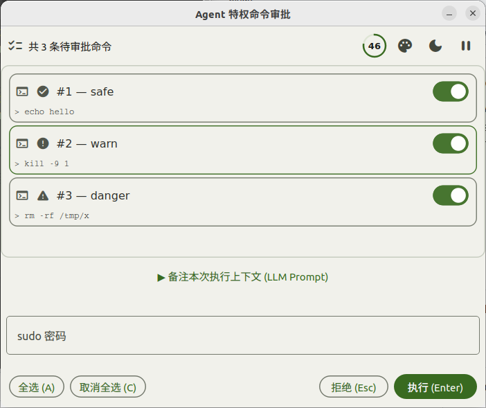
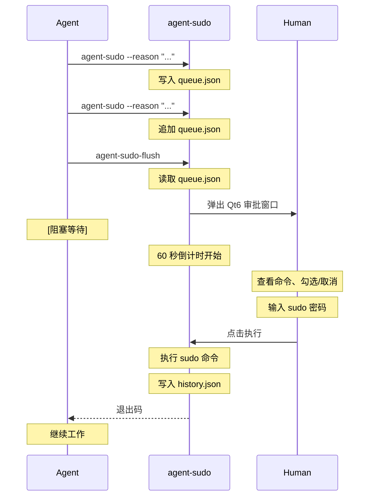

<h1 align="center">agent-sudo</h1>

<p align="center">
  AI Agent 特权命令审批网关 — 队列化 sudo 请求，通过 GUI 窗口让人类一键审批。
  <br />
  <a href="#为什么不用-pkexec--sudo"><strong>为什么不用 pkexec？ &raquo;</strong></a>
  ·
  <a href="#快速开始"><strong>快速开始 &raquo;</strong></a>
  ·
  <a href="#安装"><strong>安装 &raquo;</strong></a>
  ·
  <a href="#工作原理"><strong>工作原理 &raquo;</strong></a>
</p>

<p align="center">
  
  
  
  
</p>

---

## 这是什么

AI Agent 在执行任务时经常需要 root 权限 — 装软件包、管理系统服务、写 `/etc` 配置。但直接给 Agent 免密 sudo 太危险。

**agent-sudo** 解决了这个问题：Agent 把需要特权的命令排进队列，然后弹出一个 GUI 窗口供人类查看、勾选、审批。一条命令都不漏，一条命令都不多。

<p align="center">
  
</p>

## 为什么不用 pkexec / sudo？

| 方案 | 问题 |
|---|---|
| `sudo` 免密 | Agent 拥有不受限的 root 权限，一条 `rm -rf /` 就能毁灭系统 |
| `pkexec` | 每条命令弹一次 PolicyKit 对话框，Agent 执行 10 条命令你就要点 10 次确认，且看不到全局上下文 |
| `sudoers` 白名单 | 需要 root 编辑 `/etc/sudoers`，命令必须预先写死，Agent 需要的新命令不在白名单里就卡住 |
| PolKit 规则 | 配置复杂（XML/JS），调试困难，不适合动态的 Agent 工作流 |

**agent-sudo** 的区别：

| 特性 | agent-sudo | pkexec | sudo NOPASSWD |
|---|---|---|---|
| 批量审批 | 所有命令在一个窗口 | 逐条弹窗 | — |
| 命令理由 | 每条附带 `--reason` | 无 | 无 |
| 选择性执行 | 可取消不需要的命令 | 只能全接受或全拒绝 |
| 审计记录 | `history.json` 记录每次审批 | 仅 syslog | 仅 syslog |
| 倒计时保护 | 60 秒无人操作自动拒绝 | PolicyKit 默认超时 | 无 |
| 人类反馈 | 可留言给 Agent | 无 | 无 |
| 配置复杂度 | 零配置，开箱即用 | 需要 DBus + PolicyKit | 需要编辑 sudoers |
| 密码安全 | 内存中使用后立即清零 | PolicyKit agent 管理 | 缓存 5 分钟 |

## 快速开始

Agent 按以下模式工作：

```bash
# 1. 逐条队列特权命令，每条附带理由
agent-sudo --reason "安装编译工具链" -- apt install -y gcc make cmake
agent-sudo --reason "启动 nginx 服务" -- systemctl enable --now nginx

# 2. 一次性提交审批（弹出 GUI 窗口，阻塞等待人类操作）
agent-sudo-flush
```

人类在 GUI 窗口中：
- 看到每条命令的**理由**和**完整命令**
- 勾选/取消不需要的命令
- 输入 sudo 密码
- 点击执行或拒绝

## 功能

| 功能 | 说明 |
|---|---|
| 命令队列 | 逐条添加，批量审批；flush 后无论结果如何，队列始终清空 |
| 审批 GUI | Qt6 C++ 原生窗口，creeper-qt 声明式组件，居中于当前屏幕 |
| 单二进制分派 | `argv[0]` 检测：`agent-sudo` → 入队，`agent-sudo-flush` → 弹 GUI，同一二进制通过符号链接实现 |
| CWD 保留 | 每条命令记录入队时的当前工作目录，执行时 `cd` 到原目录运行 |
| 主题管理 | 3 套预设（BlueMiku / GoldenHarvest / Green）+ 亮/暗模式，MixerMask 展开动画 + ColorScheme 平滑插值 |
| 危险检测 | 自动识别安全/警告/危险命令，卡片边框用绿/黄/红图标区分 |
| 图标系统 | Material Icons Round 图标（codepoint），悬浮高亮边框，自定义应用 SVG 图标 |
| 键盘快捷键 | Esc 拒绝 / A 全选 / C 取消全选 / Enter 执行 / 密码框回车触发执行 |
| 多语言 | 8 种语言（zh/en/ja/ko/fr/de/es/pt），JSON 驱动，中文为内置默认 |
| 声音反馈 | 4 事件（Open / Warning / Executed / Rejected），每个可独立设为 default / none / 自定义 WAV 路径 |
| 倒计时保护 | 60 秒自动拒绝，区分超时/手动拒绝；可暂停/恢复计时 |
| 10 秒警告 | 倒计时最后 10 秒触发警告音效 |
| 点击切换 | 点击卡片任意位置切换勾选状态 |
| LLM 备注 | 可折叠文本区，人类留言给 Agent；审批/拒绝均通过 stdout 输出 `LLM_PROMPT:` |
| 执行历史 | `~/.cache/agent-sudo/history.json` 审计记录（版本化，含时间戳、状态） |
| 密码安全 | 内存中使用后立即清零；`sudo -k` 重置时间戳 |
| 认证失败识别 | 自动检测中英文密码错误提示，失败后清空队列并返回 126 |
| 输出过滤 | 执行结果自动过滤 `[sudo]` 和 `sudo:` 噪音行 |
| 文件权限 | 队列和历史文件以 0o600 写入，仅 owner 可读写 |

## 危险检测

agent-sudo 在每条命令卡片上自动标注危险等级，用图标和卡片颜色快速区分：

| 等级 | 图标 | 触发条件（部分） |
|---|---|---|
| 安全 | ✓ | 常规的 `apt install`、`echo`、`mkdir` 等 |
| 警告 | ⚠ | `systemctl stop`、`kill`/`pkill`、`chmod`、`chown`、`mount`/`umount`、`iptables` |
| 危险 | ✕ | `rm -rf`、`dd if=`、`mkfs`、`/dev/sd*`、fork bomb (`:(){ :\|:& };:`) |

> 检测基于纯字符串匹配，不解析 Shell AST。Agent **无法绕过**危险标注（标注仅影响卡片显示，不影响命令执行）。

## LLM Prompt 交互

审批窗口底部有一个可折叠的文本区域「备注本次执行上下文 (LLM Prompt)」。人类审批者可以在这里留言给 LLM Agent。

- 点击 **▶ 备注本次执行上下文** 展开输入框，输入留言
- 无论审批通过还是拒绝，如果人类写了留言，**stdout 都会输出**：
  ```
  LLM_PROMPT: <人类留言内容>
  ```
- Agent 应读取这一行并纳入后续决策
- 只在人类实际输入内容时才输出，空输入不会产生此行

## 配置

所有配置集中在 `~/.config/agent-sudo/theme.conf`（QSettings INI 格式），GUI 窗口中的主题切换按钮会实时写入此文件。

```ini
[theme]
preset=0       ; 0=BlueMiku, 1=GoldenHarvest, 2=Green
mode=0         ; 0=Light, 1=Dark

[sound]
enabled=true
event\open=default       ; default / none / 自定义 .wav 路径
event\warning=default
event\executed=default
event\rejected=none

lang=zh       ; zh / en / ja / ko / fr / de / es / pt
```

> 中文（`zh`）是内置默认语言，无需额外的语言文件。其他 7 种语言通过 `:/lang/*.json` Qt 资源文件加载。

## 安装

### 面向人类

将下面这段话复制给你的 LLM Agent：

```markdown
参考 [INSTALL.md](https://raw.githubusercontent.com/7emotions/agent-sudo/main/INSTALL.md) 安装 agent-sudo。
```

### 面向 LLM Agent

参考 [`INSTALL.md`](INSTALL.md) 了解完整安装步骤。核心依赖：

- C++23 编译器（GCC 14+）
- CMake 3.22+
- Qt6（Widgets, Network, Svg, Multimedia）
- Eigen3
- Material Icons 字体（`fonts-material-design-icons-iconfont`）
- `/usr/bin/sudo`

构建安装：

```bash
cmake -S . -B build && cmake --build build
sudo cp build/agent-sudo-flush /usr/local/bin/
sudo ln -sf /usr/local/bin/agent-sudo-flush /usr/local/bin/agent-sudo
```

## 使用示例

### 基础用法

```bash
agent-sudo --reason "安装 curl" -- apt install -y curl
agent-sudo-flush
```

### 多条命令批量审批

```bash
agent-sudo --reason "安装 Docker 依赖" -- apt install -y ca-certificates curl gnupg
agent-sudo --reason "添加 Docker GPG key" -- install -m 0755 -d /etc/apt/keyrings
agent-sudo --reason "添加 Docker 源" -- tee /etc/apt/sources.list.d/docker.list
agent-sudo-flush
```

### 工作流集成

在自动化脚本或 Agent 编排中：

```bash
# 队列所有特权操作
agent-sudo --reason "安装系统依赖" -- apt install -y build-essential git
agent-sudo --reason "安装 H.264 解码器" -- apt install -y gstreamer1.0-plugins-ugly

# 提交审批，并捕获 LLM Prompt
flush_out=$(agent-sudo-flush 2>&1)
flush_rc=$?
llm_prompt=$(echo "$flush_out" | grep '^LLM_PROMPT: ' | sed 's/^LLM_PROMPT: //')

# 根据退出码决定后续行为
case $flush_rc in
  0)   echo "审批通过，命令已执行"
       [ -n "$llm_prompt" ] && echo "人类留言: $llm_prompt" ;;
  126) echo "用户拒绝或窗口关闭"
       [ -n "$llm_prompt" ] && echo "人类留言: $llm_prompt" ;;
  124) echo "执行超时" ;;
  127) echo "错误（队列为空、无 DISPLAY 等）" ;;
esac
```

## 工作原理



## 退出码

| 码 | 含义 |
|---|---|
| 0 | 所有勾选的命令执行成功 |
| 124 | 执行超时（300 秒） |
| 126 | 用户拒绝、窗口关闭、60 秒倒计时自动拒绝、或认证失败 |
| 127 | 错误：队列为空、`$DISPLAY` 未设置、或启动失败 |

## 文件结构

```
agent-sudo/
├── src/
│   ├── main.cc                  # 主程序入口（argv[0] 分派 + creeper-qt 声明式 UI）
│   ├── gui/
│   │   ├── command_card.{h,cc}  # 命令审批卡片构建器（含危险检测）
│   │   ├── ring_countdown.{h,cc}# 36×36 环形倒计时组件（主题感知）
│   │   ├── icon.{h,cc}          # 图标提供者（Material Icons + 应用 SVG）
│   │   ├── icon_codes.h         # Material Icons Unicode codepoint 常量
│   │   ├── sound.{h,cc}         # 声音管理器（QSoundEffect，每事件可配置）
│   │   ├── theme_transition.{h,cc}  # 主题切换动画（ColorScheme 平滑插值）
│   │   ├── queue_io.{h,cc}      # 队列/历史 JSON I/O（版本化，0o600 权限）
│   │   ├── executor.{h,cc}      # sudo 子进程执行器（密码清零、认证失败检测）
│   │   ├── tr.h                 # i18n 查找（JSON 驱动，key→翻译映射）
│   │   └── creeper-qt/          # Qt6 声明式组件库（vendored，MIT）
├── lang/                        # 7 种语言 JSON 文件（zh 为内置默认）
│   ├── en.json / ja.json / ko.json / fr.json / de.json / es.json / pt.json
├── imgs/
│   └── agent-sudo-gui-v2.png    # GUI 截图
├── CMakeLists.txt               # CMake 构建配置
├── resources.qrc                # Qt 资源文件（字体 + 语言 JSON）
├── test_real_world.sh           # 端到端集成测试
├── x11_key.py                   # X11 自动化测试辅助脚本
├── SKILL.md                     # OpenCode Skill 定义（Agent 使用指南）
├── AGENTS.md                    # Agent 快速参考
├── INSTALL.md
├── LICENSE
└── README.md
```

## 致谢

本项目基于 [creeper-qt](https://github.com/creeper5820/creeper-qt) 声明式 Qt6 组件库构建，`src/gui/creeper-qt/` 为 vendored 源码。

感谢 [@creeper5820](https://github.com/creeper5820) 的优秀工作，遵循上游许可协议。

## 贡献

欢迎提交 Issue 和 Pull Request。

## 许可

MIT License © 2026 Lorenzo Feng — 详见 [LICENSE](LICENSE)。

`src/gui/creeper-qt/` 为 vendored 第三方代码，遵循其原始许可协议。
